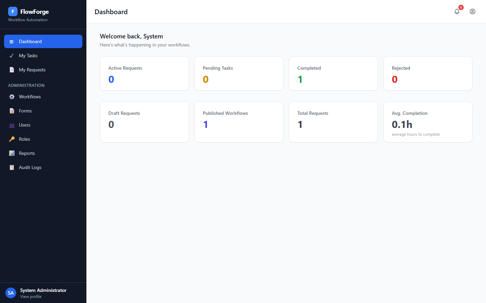
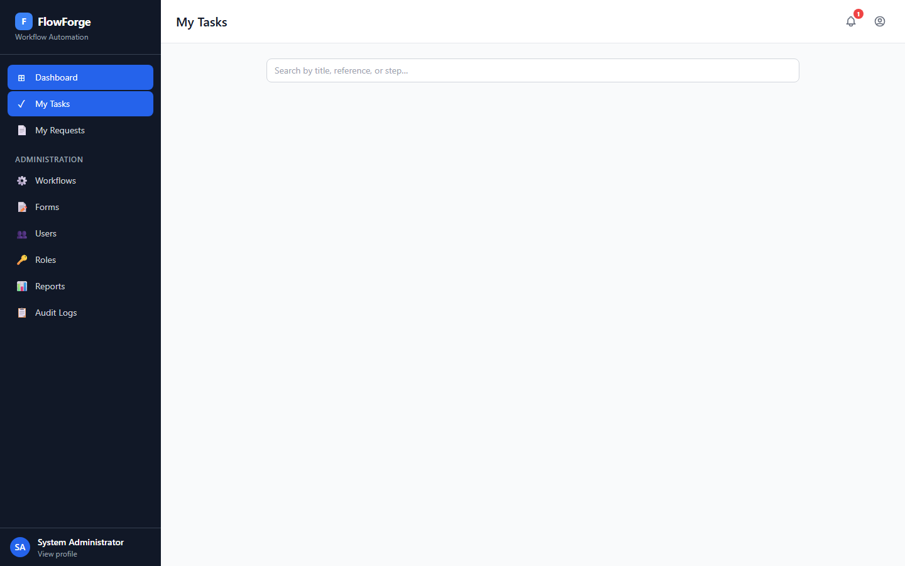
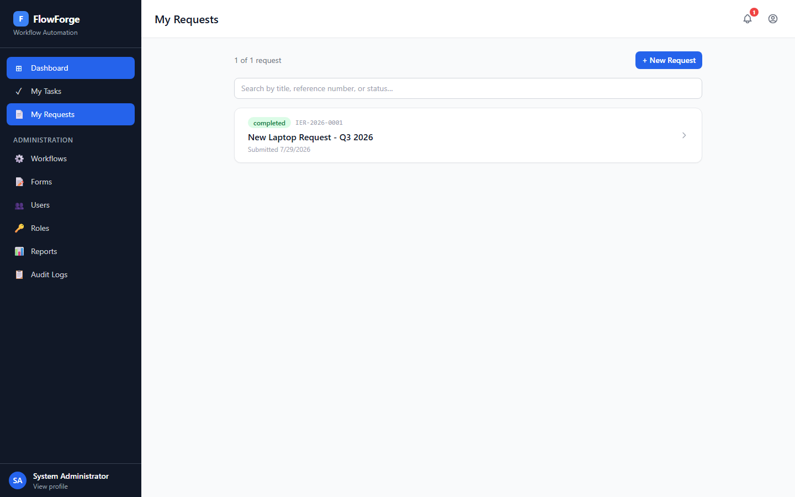
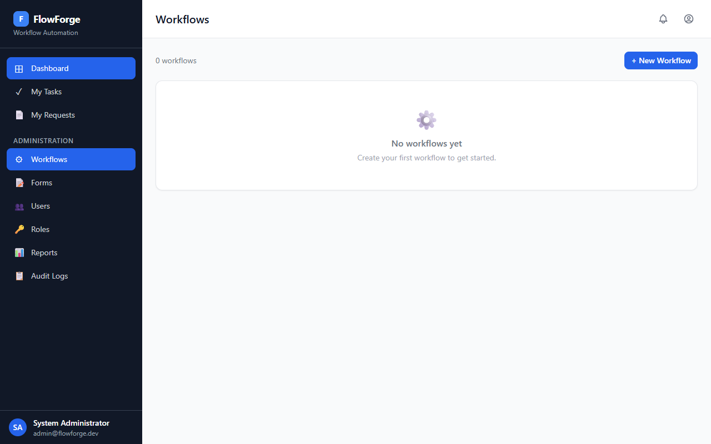
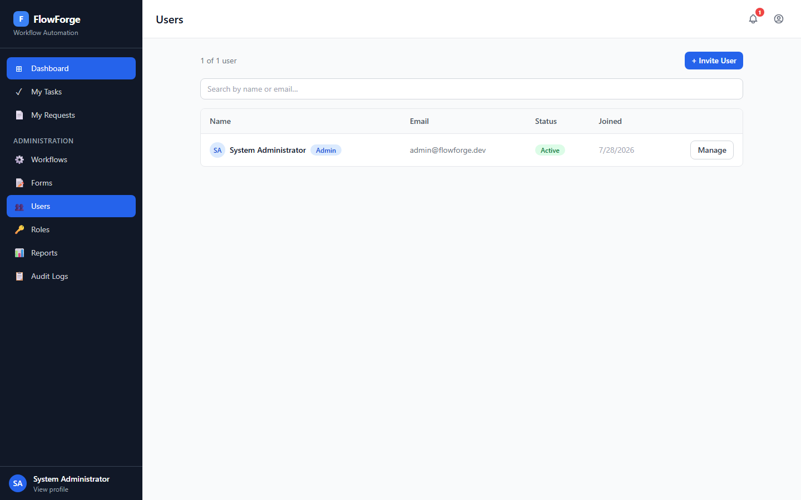
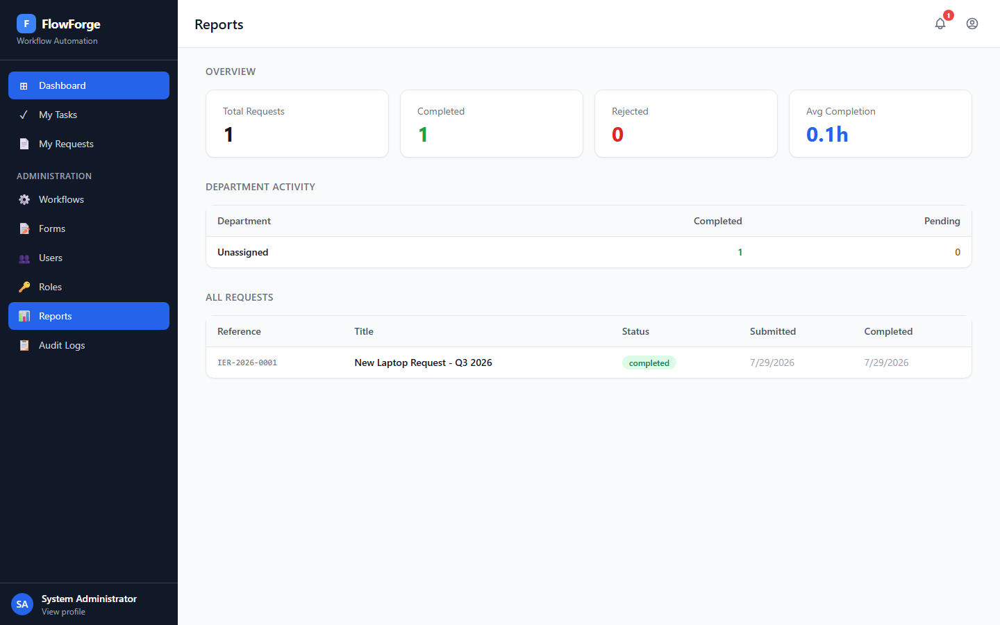
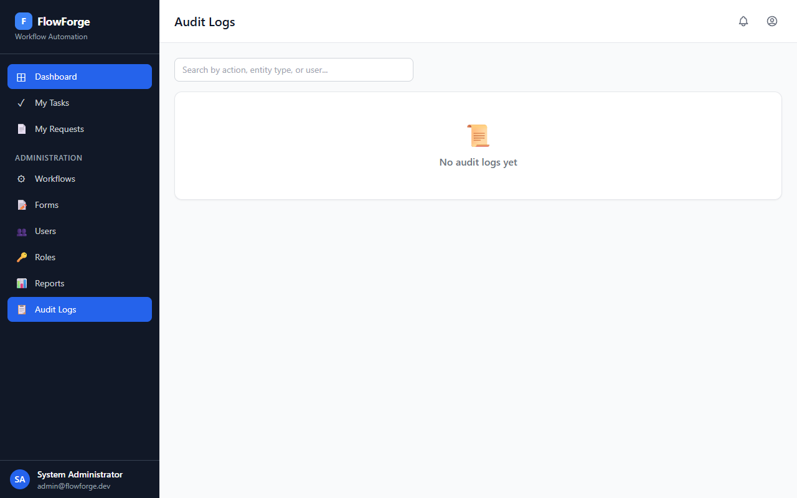
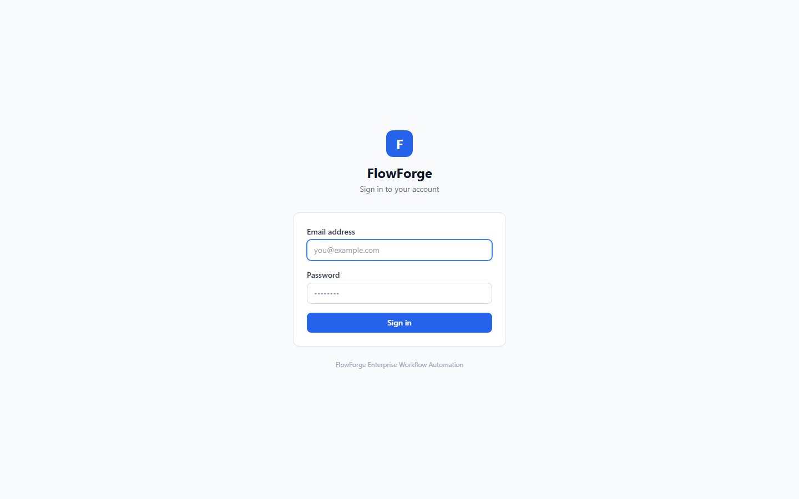

# FlowForge

**Enterprise workflow automation platform** — digitize and automate business approval processes with configurable multi-step workflows, role-based task assignment, real-time notifications, and a complete audit trail.

Built as a full-stack demonstration of enterprise software patterns: modular NestJS backend, Next.js frontend, JWT authentication, permission-based access control, and event-driven async processing.

**[Live Demo →](https://flowforge-platform.vercel.app)** | **[API Docs →](https://backend-production-4337.up.railway.app/api/docs)**

Demo credentials: `admin@flowforge.dev` / `Admin@1234`

---

## Screenshots

| Dashboard | Task Inbox |
|-----------|-----------|
|  |  |

| My Requests | Workflow Admin |
|-------------|---------------|
|  |  |

| User Management | Reports |
|-----------------|---------|
|  |  |

| Audit Logs | Login |
|------------|-------|
|  |  |

---

## Features

- **Configurable Workflows** — Build multi-step approval chains (e.g. Requester → Supervisor → Finance → Director) without writing code
- **Dynamic Forms** — Attach custom forms to workflows with typed fields and validation
- **Role & Department Assignment** — Assign workflow steps to specific users, roles, or entire departments
- **Task Inbox** — Assignees see pending tasks and can approve, reject, or return requests with comments
- **Approval History** — Immutable record of every decision made on a request
- **In-App Notifications** — Real-time alerts on task assignment and status changes
- **Email Notifications** — Configurable SMTP emails for task assignments and status changes; per-user opt-out toggle
- **File Attachments** — Attach supporting documents to requests (validated type/size)
- **User Profile** — Edit name, manage email notification preferences
- **Audit Trail** — Every significant action logged with user, timestamp, and metadata
- **Reports & Metrics** — Dashboard with completion rates, department activity, and cycle times
- **JWT Authentication** — Access + refresh token rotation, argon2id password hashing
- **Permission-Based Authorization** — 44 granular permissions assignable per role

---

## Architecture

```
┌─────────────────────────────────┐
│         Next.js Frontend        │  :3001
│   (App Router · Tailwind CSS)   │
└────────────────┬────────────────┘
                 │ REST API
┌────────────────▼────────────────┐
│        NestJS Backend           │  :3000
│  (Modular Monolith · TypeScript)│
└──────┬─────────────────┬────────┘
       │                 │
┌──────▼──────┐   ┌──────▼──────┐
│ PostgreSQL  │   │    SMTP     │
│  (Drizzle)  │   │  (Email)   │
└─────────────┘   └─────────────┘
```

**Backend modules:**

| Module | Responsibility |
|--------|---------------|
| `auth` | Login, refresh tokens, JWT strategy |
| `users` | User management, profile |
| `organizations` | Multi-org support |
| `departments` | Org hierarchy |
| `roles` + `permissions` | RBAC with 44 granular permissions |
| `workflows` + `forms` | Process and form definitions |
| `workflow-instances` | Request lifecycle state machine |
| `tasks` | Task assignment and execution |
| `approvals` | Immutable decision records |
| `notifications` | In-app notification delivery |
| `mail` | SMTP email notifications (nodemailer, graceful no-op when unconfigured) |
| `attachments` | File upload and authorized download |
| `audit-logs` | Business and security event trail |
| `reports` | Metrics and analytics aggregation |

---

## Tech Stack

| Layer | Technology |
|-------|-----------|
| Frontend | Next.js 14 · React 18 · TypeScript |
| Styling | Tailwind CSS |
| Backend | NestJS · TypeScript |
| API | REST · OpenAPI / Swagger |
| Database | PostgreSQL 16 |
| ORM | Drizzle ORM |
| Validation | Zod |
| Auth | JWT (access + refresh) · argon2id |
| Email | Nodemailer (SMTP, optional) |
| Testing | Jest · Vitest · Playwright |
| Containers | Docker · Docker Compose |

---

## Quick Start

### Prerequisites

- [Node.js 18+](https://nodejs.org)
- [Docker Desktop](https://www.docker.com/products/docker-desktop/)

### 1 — Start the database and Redis

```bash
docker-compose up postgres redis -d
```

### 2 — Start the backend

```bash
cd backend
cp .env.example .env        # copy environment config
npm install
npm run db:generate         # generate migrations
# apply migration (see Database Setup below)
npm run seed                # create admin user and seed permissions
npm run start:dev
```

Backend runs at **http://localhost:3000**
API docs (Swagger) at **http://localhost:3000/api/docs**

> **Email notifications** are optional. Set `SMTP_HOST` in `.env` to enable them. The server starts and functions normally without any SMTP configuration.

### 3 — Start the frontend

```bash
cd frontend
cp .env.example .env.local
npm install
npm run dev
```

Frontend runs at **http://localhost:3001**

### 4 — Log in

| Field | Value |
|-------|-------|
| Email | `admin@flowforge.dev` |
| Password | `Admin@1234` |

---

## Database Setup

FlowForge uses Drizzle ORM migrations. After changing the schema or on first setup:

```bash
# 1. Generate migration SQL
cd backend
npm run db:generate

# 2. Apply the migration
docker cp drizzle/migrations/<latest>.sql flowforge-db:/migration.sql
docker exec flowforge-db psql -U postgres -d flowforge -f /migration.sql
```

---

## Full Docker Deployment

To run everything in containers:

```bash
# Set secure JWT secrets (required for production)
export JWT_ACCESS_SECRET=your-secure-secret
export JWT_REFRESH_SECRET=your-other-secure-secret

docker-compose up --build
```

After containers start, run migrations and seed inside the backend container:

```bash
docker exec flowforge-backend node dist/database/seed.js
```

---

## Testing

### Backend unit tests (Jest, no database required)

```bash
cd backend
npm test
```

Covers: `AuthService` (login, password hashing, permissions), `WorkflowInstancesService` (transition guards, cancel, submit, reject flow).

### Frontend unit tests (Vitest)

```bash
cd frontend
npm test
```

Covers: API token helpers, `statusBadge` mapping for all workflow statuses.

### End-to-end tests (Playwright)

```bash
# Install browser binaries once
npx playwright install chromium

# Run against a local or deployed instance
PLAYWRIGHT_BASE_URL=https://flowforge-platform.vercel.app \
E2E_USER_EMAIL=admin@flowforge.dev \
E2E_USER_PASSWORD=Admin@1234 \
npm run test:e2e
```

Covers: login flow, unauthenticated redirect, My Requests, My Tasks, Admin pages, Profile.

---

## API Reference

Full interactive API documentation is available at `/api/docs` when the backend is running.

Key endpoints:

```
POST   /api/auth/login                  Authenticate
GET    /api/auth/me                     Current user profile

GET    /api/workflows                   List workflows
POST   /api/workflows                   Create workflow
PATCH  /api/workflows/:id/publish       Publish workflow

POST   /api/instances                   Create request
POST   /api/instances/:id/submit        Submit for approval
POST   /api/instances/:id/transition    Approve / reject / return

GET    /api/tasks/my                    My assigned tasks
PATCH  /api/tasks/:id/start             Start a task

GET    /api/reports/dashboard           Dashboard metrics
GET    /api/audit-logs                  Audit trail
```

---

## Project Structure

```
FlowForge/
├── backend/                    NestJS API
│   ├── src/
│   │   ├── auth/
│   │   ├── users/
│   │   ├── workflows/
│   │   ├── workflow-instances/ ← state machine core
│   │   ├── tasks/
│   │   ├── approvals/
│   │   ├── notifications/
│   │   ├── attachments/
│   │   ├── audit-logs/
│   │   ├── reports/
│   │   └── database/           schema · migrations · seed
│   └── Dockerfile
├── frontend/                   Next.js app
│   ├── app/
│   │   ├── login/
│   │   └── dashboard/
│   │       ├── tasks/          task inbox
│   │       ├── requests/       request management
│   │       ├── notifications/
│   │       ├── reports/
│   │       ├── audit-logs/
│   │       └── admin/          workflows · forms · users · roles
│   ├── components/
│   │   ├── layout/             sidebar · header
│   │   └── ui/                 button · card · modal · badge · input
│   ├── context/                auth context
│   └── Dockerfile
└── docker-compose.yml
```

---

## Workflow Execution Flow

```
Create Draft
     ↓
  Submit  ──────────────────────── validates required fields
     ↓                             creates first task
     ↓                             notifies assignee
  [Task assigned]
     ↓
  Start Task (pending → in_progress)
     ↓
  Decision:
  ├── Approve ──→ next step task created  (or Completed if last step)
  ├── Reject  ──→ instance marked Rejected
  └── Return  ──→ returns to submitter for revision
```

Each transition:
- records an immutable approval entry
- updates instance and task status in a single DB transaction
- sends notifications to relevant parties
- writes an audit log entry

---

## License

MIT
